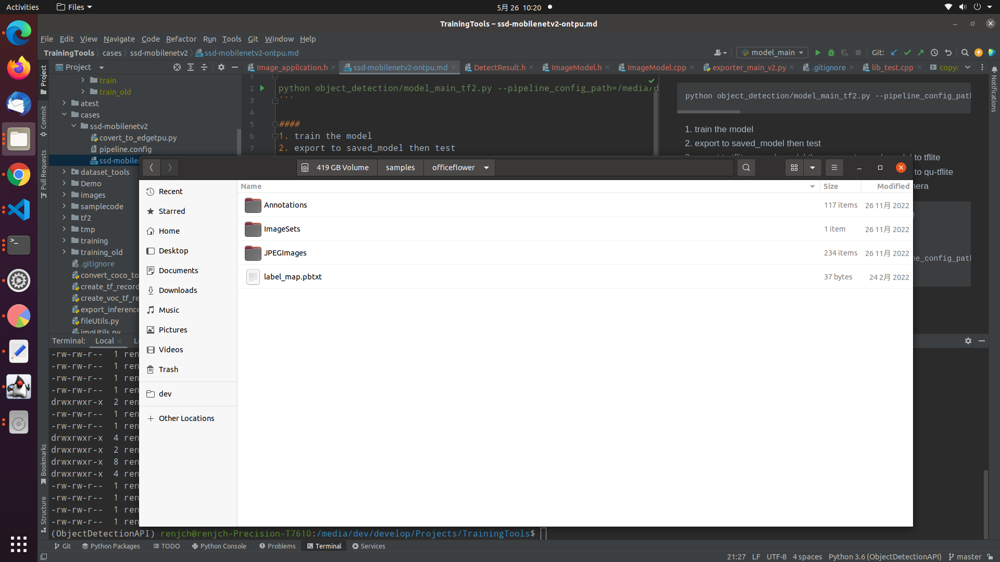

```
python object_detection/model_main_tf2.py --pipeline_config_path=/media/dev/home/dev/TrainingTools/.data/officeflower/models/my_model_dir/pipeline.config --model_dir=/media/dev/home/dev/TrainingTools/.data/officeflower/train --num_train_steps=100 --sample_1_of_n_eval_examples=20 --alsologtostderr
```

#### 
1. train the model
2. export to saved_model then test
3. export to tflite_saved_model then convert saved_model to tflite 
4. export to tflite_saved_model then convert saved_model to qu-tflite 
5. compile the qu-tflite to edge-tpu, then deploy on the camera

```
PIPELINE_CONFIG_PATH={path to pipeline config file}
MODEL_DIR={path to model directory}
CHECKPOINT_DIR=${MODEL_DIR}
MODEL_DIR={path to model directory}
python object_detection/model_main_tf2.py --pipeline_config_path=C:/cases/missingbelt/models/my_model_dir/pipeline.config --model_dir=C:/cases/missingbelt/val --checkpoint_dir=C:/cases/missingbelt/train --alsologtostderr

```


1. prepare image data set. This dataset format is pascal.


2. Use create_pascal_tf_record.py script to generate the .tfrecord dataset.
```bash
python create_pascal_tf_record.py --data_dir=/media/dev/samples/officeflower --output_path=xxx.tfrecord
```

3. Use pascal_tf_record_view.py script to review the data is correct or not.
```bash
python pascal_tf_record_view.py data.tfrecord object_name
```